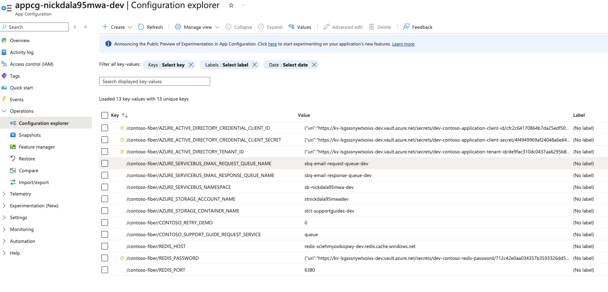

# Modern Web App Patterns: Strangler Fig

## Introduction

In today's fast-paced technological landscape, modernizing Java applications is crucial for achieving scalability, maintainability, and performance. Legacy systems often struggle to keep up with the demands of modern users and evolving business requirements. By adopting modern architectural patterns, organizations can ensure their applications remain competitive and capable of handling increased workloads.

## The Strangler Pattern: A Strategy for Incremental Modernization

As applications age, the tools, technologies, and architectures they rely on can become outdated. Introducing new features can increase complexity, making these systems harder to maintain and evolve. Completely rewriting a complex system is often a massive and risky undertaking. The **Strangler Fig Pattern** offers a solution by allowing you to incrementally migrate a legacy system. This is achieved by gradually replacing specific pieces of functionality with new applications and services.

Inspired by the strangler fig tree that grows around and eventually replaces its host, this pattern involves creating a façade that intercepts requests to the backend legacy system. The façade routes these requests either to the legacy application or the new services. This approach enables existing features to be migrated gradually, while consumers continue using the same interface, unaware of the changes happening behind the scenes.

**Key Benefits of the Strangler Pattern:**

- **Minimized Risks:** Incremental changes reduce the likelihood of system-wide disruptions.
- **No Downtime:** Updates occur without halting the system, ensuring continued availability.
- **Parallel Operations:** Legacy and modern systems coexist during migration, providing flexibility for gradual transitions.
- **Client Transparency:** Clients don't need to know where specific features are located, as the façade handles request routing.

By gradually replacing the legacy system's features, the new system eventually encompasses all functionalities, allowing you to safely decommission the old system.

**Issues and Considerations:**

- **Shared Resources:** Ensure both new and legacy systems can access shared services and data stores during the transition.
- **Façade Design:** Structure the façade to avoid becoming a single point of failure or a performance bottleneck.
- **Future Migrations:** Design new applications and services so they can be easily intercepted and replaced in future migrations.
- **Migration Pace:** Keep the façade updated with the migration progress to maintain seamless operation.

**When to Use This Pattern:**

- **Gradual Migration Needs:** When you need to migrate a backend application to a new architecture incrementally.
- **Risk Mitigation:** When a complete system overhaul is too risky or impractical.

**When This Pattern May Not Be Suitable:**

- **Non-Interceptable Requests:** If requests to the backend system cannot be intercepted.
- **Simpler Systems:** For smaller applications where a complete replacement is manageable and less complex.

**Alignment with Azure Well-Architected Framework:**

- **Reliability:** The incremental approach mitigates risks during transitions, enhancing system resilience.
- **Cost Optimization:** Maximizes the use of existing investments while modernizing incrementally, allowing high-ROI replacements first.
- **Operational Excellence:** Supports continuous improvement with small, manageable changes over time, reducing deployment risks.

*Read Martin Fowler's original article on the Strangler Fig Application [here](https://martinfowler.com/bliki/StranglerFigApplication.html).*

## Implementing the Strangler Pattern with Modern Web App (MWA) Patterns

Combining the Strangler Pattern with the **Modern Web App (MWA) Pattern** provides a robust foundation for creating cloud-native, scalable applications. The MWA pattern emphasizes resilience, security, and scalability, leveraging cloud services and best practices.

**Core Tenets of the MWA Pattern:**

- **Microservices:** Breaking monoliths into independently deployable components.
- **Containerization:** Ensuring consistency across diverse environments using containers.
- **Cloud-Native Services:** Leveraging platforms like **Azure Kubernetes Service (AKS)** and **Azure App Service**.
- **Automated Pipelines:** Implementing Continuous Integration and Continuous Deployment (CI/CD) for rapid delivery.

### Example: Routing with the Strangler Pattern

Imagine you're migrating a `/customer` endpoint from a legacy system to a modernized architecture. You can deploy a router that directs requests to either the old or new implementation based on specific conditions.

#### Java Code Example

```java
@RestController
@RequestMapping("/api")
public class CustomerRouterController {
    private final LegacyCustomerService legacyService;
    private final ModernCustomerService modernService;

    public CustomerRouterController(LegacyCustomerService legacyService, ModernCustomerService modernService) {
        this.legacyService = legacyService;
        this.modernService = modernService;
    }

    @GetMapping("/customer")
    public ResponseEntity<Customer> getCustomer(@RequestParam String id) {
        if (isModernCustomer(id)) {
            Customer customer = modernService.getCustomerById(id);
            return ResponseEntity.ok(customer);
        }
        Customer customer = legacyService.getCustomerById(id);
        return ResponseEntity.ok(customer);
    }

    private boolean isModernCustomer(String id) {
        // Logic to determine if the request should be routed to the modern service
        return id.startsWith("MODERN_");
    }
}
```

This example uses a centralized router to direct requests based on specific criteria, such as the format of the customer ID. It enables both legacy and modern systems to coexist during the transition period.

## Reference Implementation: Modern Java Web App Patterns

The sample implementation in this repository mirrors the approach provided in the [Modern Java Web App Patterns](https://github.com/azure/modern-web-app-pattern-java) repository. Both implementations utilize the Strangler Pattern for incremental modernization.

**Key Aspects of the Reference App Implementation:**

- **Gradual Replacement:** Replacing parts of the legacy system incrementally with new functionality.
- **Routing Logic:** Directing requests to the appropriate service (legacy or modern) based on specific criteria.
- **Asynchronous Communication:** Using message queues for reliable, decoupled interactions between services.
- **Containerization:** Deploying services consistently across environments using container apps.
- **Comprehensive Documentation:** Providing step-by-step instructions for setting up, deploying, and managing the application transition.

For detailed guidance, visit the [Modern Java Web App Patterns](https://github.com/azure/modern-web-app-pattern-java) repository.


## Running the Spring Boot Sample

Follow these steps to run the Spring Boot sample demonstrating the Strangler Pattern.

### Prerequisites

Ensure you have the following tools installed:

- **JDK 17**: [Download](https://www.oracle.com/java/technologies/javase-jdk17-downloads.html)
- **Apache Maven**: [Download](https://maven.apache.org/download.cgi)
- **Visual Studio Code**: [Download](https://code.visualstudio.com/Download)
- **Java Extension Pack for Visual Studio Code**: [Marketplace](https://marketplace.visualstudio.com/items?itemName=vscjava.vscode-java-pack)

### Steps to Run

1. **Clone the Repository**

   ```bash
   git clone https://github.com/roryp/stranglerfig.git
   cd stranglerfig
   ```

2. **Build the Project**

   ```bash
   mvn clean install
   ```

3. **Run the Application**

   ```bash
   mvn spring-boot:run
   ```

   The application starts on port 8080 by default.

4. **Test the Application**

   Send requests to the `/api/customer` endpoint:

   - **Modern Customer ID**

     ```bash
     curl http://localhost:8080/api/customer?id=MODERN_1
     ```

     This request is routed to the modern customer service.

   - **Legacy Customer IDs**

     ```bash
     curl http://localhost:8080/api/customer?id=LEGACY_1
     ```

     These requests are routed to the legacy customer service.

### Feature Flags and Azure App Configuration

#### FF4j: Feature Flipping for Java

[FF4j (Feature Flipping for Java)](https://ff4j.org/) is a library that enables dynamic activation and deactivation of features in Java applications. It allows developers to manage features without redeploying code, facilitating:

- **Dynamic Feature Management:** Toggle features at runtime.
- **A/B Testing:** Gradually roll out features to subsets of users.
- **Monitoring and Auditing:** Track feature usage and performance.

FF4j can be integrated into Spring Boot applications, providing a web console and APIs for feature management.

#### Azure App Configuration for Feature Flags

The Modern Web App pattern reference sample leverages [Azure App Configuration](https://azure.microsoft.com/services/app-configuration/) to manage application settings and feature flags centrally. This service is particularly useful when implementing the Strangler Pattern, as it supports feature toggling and the gradual rollout of new features.

**Benefits of Azure App Configuration:**

- **Centralized Management:** Simplify configuration across multiple applications and environments.
- **Real-Time Updates:** Modify settings and feature flags without application restarts.
- **Feature Flags:** Control feature exposure to users, enabling staged rollouts.
- **Seamless Integration:** Works well with Azure services and supports various programming languages.

##### Example: Using Azure App Configuration in a Spring Boot Application

1. **Add the Dependency** to your `pom.xml`:

   ```xml
   <dependency>
       <groupId>com.azure.spring</groupId>
       <artifactId>azure-spring-cloud-feature-management-web</artifactId>
       <version>2.3.0</version>
   </dependency>
   ```

2. **Configure Connection Settings** in `application.properties`:

   ```properties
   spring.cloud.azure.appconfiguration.stores[0].endpoint=https://<your-app-config-name>.azconfig.io
   spring.cloud.azure.appconfiguration.stores[0].connection-string=<your-connection-string>
   ```

3. **Implement Feature Flags** in your code:

   ```java
   @RestController
   @RequestMapping("/api")
   public class FeatureFlagController {

       @GetMapping("/feature")
       @FeatureGate(feature = "BetaFeature")
       public ResponseEntity<String> getFeature() {
           return ResponseEntity.ok("Beta Feature is enabled!");
       }
   }
   ```

   With this setup, the `/feature` endpoint will only be active if the `BetaFeature` flag is enabled in Azure App Configuration.

## Demo

### Reference app Configuration

After you deploy CAMS using `azd up`, the application is automatically set up to use the new email service. The default value for `CONTOSO_SUPPORT_GUIDE_REQUEST_SERVICE` is `queue` in the App Service, sending email requests to the Azure Service Bus. These requests are then handled by the `email-processor` container app. This setting is stored in Azure App Configuration.



To try out the new messaging functionality, follow the steps in the reference application's [demo.md](https://github.com/Azure/modern-web-app-pattern-java/blob/main/demo.md).

## Conclusion

Modernizing Java applications using the Strangler Pattern and Modern Web App Pattern provides a strategic approach to incrementally evolve legacy systems. By leveraging these patterns, organizations can achieve scalability, maintainability, and performance while minimizing risks and ensuring continuous availability.

## Useful Links

- [Martin Fowler's Strangler Fig Application](https://martinfowler.com/bliki/StranglerFigApplication.html)
- [Modern Java Web App Patterns Repository](https://github.com/azure/modern-web-app-pattern-java)
- [JDK 17 Downloads](https://www.oracle.com/java/technologies/javase-jdk17-downloads.html)
- [Apache Maven Downloads](https://maven.apache.org/download.cgi)
- [Visual Studio Code Downloads](https://code.visualstudio.com/Download)
- [Java Extension Pack for Visual Studio Code](https://marketplace.visualstudio.com/items?itemName=vscjava.vscode-java-pack)
- [FF4j Official Website](https://ff4j.org/)
- [Azure App Configuration](https://azure.microsoft.com/services/app-configuration/)
